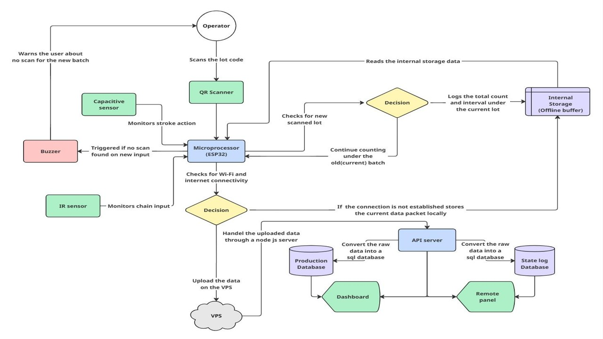
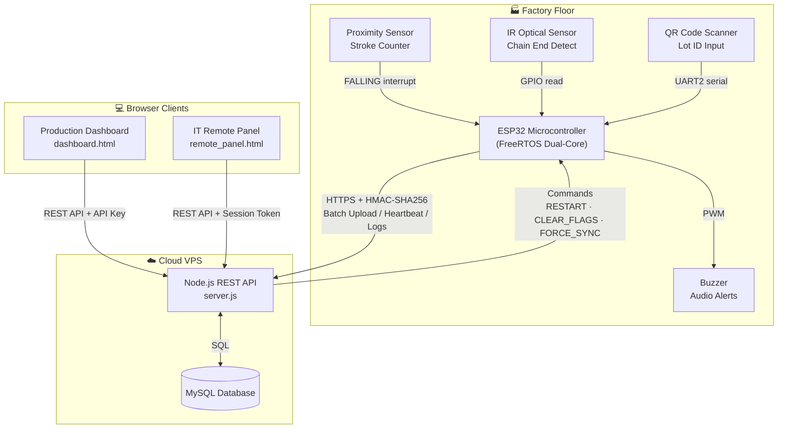
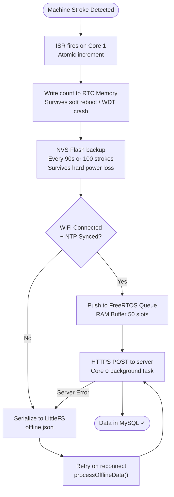
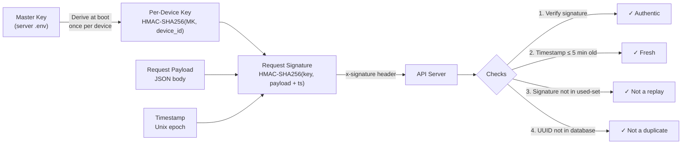

# ESP32 Industrial Production Counter System

> A full-stack IoT system deployed in a **live factory environment** — tracking machine output in real-time across multiple production lines, with enterprise-grade reliability and zero data loss guarantees.

---

## What This Project Does

Factories need to know exactly how many units every machine produced, in every shift, every day. Doing this manually is slow and error-prone. This system automates it entirely.

An **ESP32 microcontroller** mounts directly on each machine. It counts every stroke the machine makes via an inductive proximity sensor, associates each production run with a scanned **QR code lot ID**, and streams the data securely to a cloud backend. Production managers see live KPIs on a web dashboard. IT administrators can remotely monitor, diagnose, and control every device in the fleet — without stepping onto the factory floor.

The system was designed and built **from scratch** and deployed in a **real industrial facility**.

---

## Project Workflow

---

## Tech Stack

| Layer | Technology |
|---|---|
| Embedded Firmware | C++ · Arduino Framework · FreeRTOS · ESP32 |
| Cryptography | HMAC-SHA256 · mbedTLS · UUIDv4 |
| Offline Storage | LittleFS · ESP32 NVS · RTC Memory |
| Backend | Node.js · Express.js · MySQL |
| Frontend | Vanilla JS · HTML5 · Chart.js |
| Protocol | HTTPS · REST · TLS |
| Deployment | Linux VPS · NGINX · PM2 |

---

## System Architecture

---

## Resilience & Data Persistence

This was one of the hardest engineering problems. A factory machine doesn't care if the WiFi drops or the power goes out mid-shift. The system must never lose a single count.

**Three independent layers — all running simultaneously:**

| Tier | Storage | Survives | Capacity |
|------|---------|----------|----------|
| **RTC Memory** | On-chip RTC RAM | Soft reboot · WDT crash · Brownout | Current batch only |
| **NVS Flash** | Dedicated flash partition | Hard power loss · any reset | Current batch |
| **LittleFS File** | Main flash filesystem | Power loss + WiFi outage | Weeks of batches |

---

## Security Design

No raw credentials ever leave the device. Even if a request is intercepted, it cannot be replayed — the timestamp and rolling signature set reject it.

---

## Key Engineering Challenges Solved

### 1. ISR Timing on a Dual-Core RTOS
Machine strokes fire as hardware interrupts on Core 1. Network I/O runs as FreeRTOS tasks on Core 0. Without explicit synchronization, the ISR and network tasks would race on the stroke counter. Solved with `portMUX_TYPE` critical sections that work safely from both ISR and task context.

### 2. Time Integrity Without Reliable NTP
The device may boot offline or the factory may block UDP (NTP runs on UDP port 123). If the clock is wrong, every timestamp in the database is wrong. Solution: HTTP-based time sync chain (worldtimeapi.org → time.akamai.com → UDP NTP as last resort), and retroactive timestamp correction — the backend recalculates real epoch timestamps from monotonic system-time offsets after connectivity is restored.

### 3. Heap Fragmentation in Long-Running Firmware
The ESP32 has ~300KB of heap. Using Arduino's `String` class for cryptographic operations (32 sequential `realloc` calls per HMAC signature) caused heap fragmentation over hours of runtime. Refactored to zero-heap-allocation crypto using stack-allocated `char[]` buffers and mbedTLS incremental HMAC updates.

### 4. Lot-Switch Crash Safety
If a crash occurs exactly between `resetBatch()` and `initRTCState()` — the tiny window where the old lot is cleared but the new one isn't written — RTC memory would contain stale data. Solution: CRC32-validated RTC state with cross-validation against NVS. On mismatch, the stale batch is salvaged as `PARTIAL_RECOVERY` before loading the current NVS state.

### 5. Industrial WiFi Environment
Factory floors have dense 2.4GHz interference and enterprise "Smart Connect" routers that attempt 5GHz band steering. The ESP32 is physically 2.4GHz-only, so band steering causes silent disconnections. Fixed by explicitly setting the WiFi protocol to `b/g/n` only (`esp_wifi_set_protocol`), disabling power-saving mode, and running reconnection in a dedicated FreeRTOS task so it never blocks the sensor ISR.

---

## Features

### ESP32 Firmware (`main_esp_v2.ino`)
- Interrupt-driven stroke counting — up to 1.5 strokes/sec with hardware debounce
- 3-state machine with automatic chain-end detection via IR sensor
- Multi-AP WiFi failover across up to 5 networks
- 3-tier data persistence (RTC → NVS → LittleFS)
- HMAC-SHA256 signed requests with per-device derived keys
- FreeRTOS dual-core architecture (sensors on Core 1, networking on Core 0)
- Remote commands: `RESTART`, `CLEAR_FLAGS`, `FORCE_SYNC` via heartbeat pull

### Backend (`server.js`)
- Physics-based duration arbitration across 4 independent time signals
- Sub-second uptime tracking with midnight-boundary awareness
- Idempotent batch ingestion via UUIDv4
- Rolling replay attack prevention
- In-memory command queue with automatic TTL cleanup
- Graceful shutdown with pending-data flush

### Production Dashboard
- Live KPI cards: total units, active batches, daily runs
- Paginated, filterable batch table (lot, device, date range, shift)
- Chart.js timeline and shift-hour breakdown charts
- Professional CSV export (Excel-formatted with headers)
- PDF and image export

### IT Remote Panel
- Live fleet status for all connected devices
- Real-time serial log streaming through the cloud
- Remote command dispatch (reboot, clear flags, force sync)
- Uptime breakdown reports (online / idle / warning / offline)

---

## Hardware Wiring

| GPIO | Component | Mode | Notes |
|------|-----------|------|-------|
| 13 | Inductive proximity sensor | Input (PULLUP) | Interrupt, FALLING edge |
| 27 | IR optical sensor | Input (PULLUP) | Chain end detection |
| 18 | Buzzer | Output (PWM 2kHz) | 8-bit, 50% duty = audible |
| 16 | QR scanner RX | UART2 | 9600 baud, RS232 |
| 17 | QR scanner TX | UART2 | 9600 baud, RS232 |

---

## License

MIT
